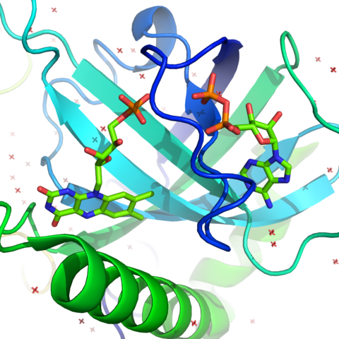

# Kinase: A Lecture Series to 10 Min Mini-Lecture Processing Pipeline



Riboflavin Kinase ([Source](https://commons.wikimedia.org/wiki/File:Riboflavin_kinase.png))

## Dependencies

```sh
brew install yt-dlp
brew install ffmpeg
```

`cookies.txt`, downloaded such as with [Get cookies.txt LOCALLY](https://chrome.google.com/webstore/detail/get-cookiestxt-locally/cclelndahbckbenkjhflpdbgdldlbecc)

Python 3.10 until [Ray](https://www.ray.io/) library updates to Python 3.11 or later

```
pip install -r requirements.txt
```

## Overview
The goal of the project is to design a processing pipeline that can convert entire lecture series into 10-minute mini-lecture segments. This pipeline will be comprised of 4 scripts with functionalities ranging from downloading the lecture series from YouTube to uploading the resulting segments back to YouTube.

## Design

### Script 1: Download lecture series from YouTube
The first script will leverage yt-dlp to download lecture series from YouTube. It will store the downloaded content in an mp4 format. It will also use YouTube's automatic caption feature or a speech-to-text service to generate transcripts in srt format.

### Script 2: Split videos and transcripts into up to 10-minute segments
The second script will process the downloaded video and transcripts, segmenting them into 10-minute segments. The video splitting can be done using a tool like FFmpeg, and the transcript can be split according to the timestamps on the srt files.

### Script 3: Generate segment title, summary, and tags using ChatGPT
The third script will use the ChatGPT model to generate titles, summaries, and tags for each segment. It will take the segmented transcript as input and use the natural language processing capabilities of ChatGPT to extract the most salient points and generate a coherent summary.

### Script 4: Upload the segmented videos to YouTube
The fourth script will upload each of the segmented videos, along with their associated titles, summaries, and tags back to YouTube using the YouTube API. This script will handle any necessary YouTube authentication and provide an interface for inputting the necessary metadata (like channel ID, playlist, etc.).

## Videos File Structure

```
/videos
    |
    |--- /<video>
    |    |--- original_video
    |    |--- renamed_video
    |    |--- /segment
    |    |    |--- segment_video
    |    |    |--- segment_transcript
    |    |    |--- segment_metadata
    |    |--- /segment
    |    |    |--- segment_video
    |    |    |--- segment_transcript
    |    |    |--- segment_metadata
    |--- /<video>
    |    |--- original_video
    |    |--- renamed_video
    |    |--- /segment
    |    |    |--- segment_video
    |    |    |--- segment_transcript
    |    |    |--- segment_metadata
    |    |--- /segment
    |    |    |--- segment_video
    |    |    |--- segment_transcript
    |    |    |--- segment_metadata
```
